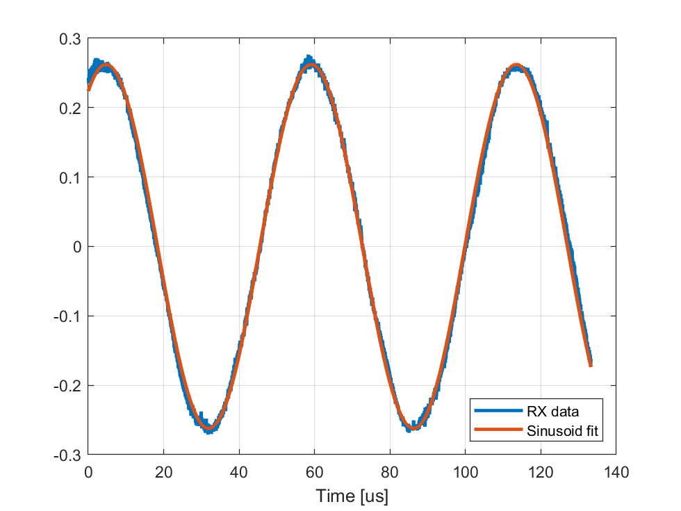

# Lab 2: Frequency Estimation and Carrier Frequency Offset

Complex exponentials are the most fundamental signals for all frequency domain
 analysis of linear system.  In this lab you will learn to:
 
* Send a complex exponential or continuous-wave (CW) signal through the SDR
* Estimate the complex gain and frequency of a sinusoid via a simple correlation method
* Estimate the gain and frequency via an FFT method with oversampling
* Estimate the carrier frequency offset
* Save data for files for offline processing 

## Files:

* The main file is `labFreq.mlx`:  [[Matlab]](./labFreq.mlx) [[PDF]](./labFreq.pdf).
* The file `estFreq.m` is a function for computing the estimated frequency.

For the lab, complete the `TODO` sections in both files, run `labFreq.mlx`,
and print to PDF.  Submit the PDF.
