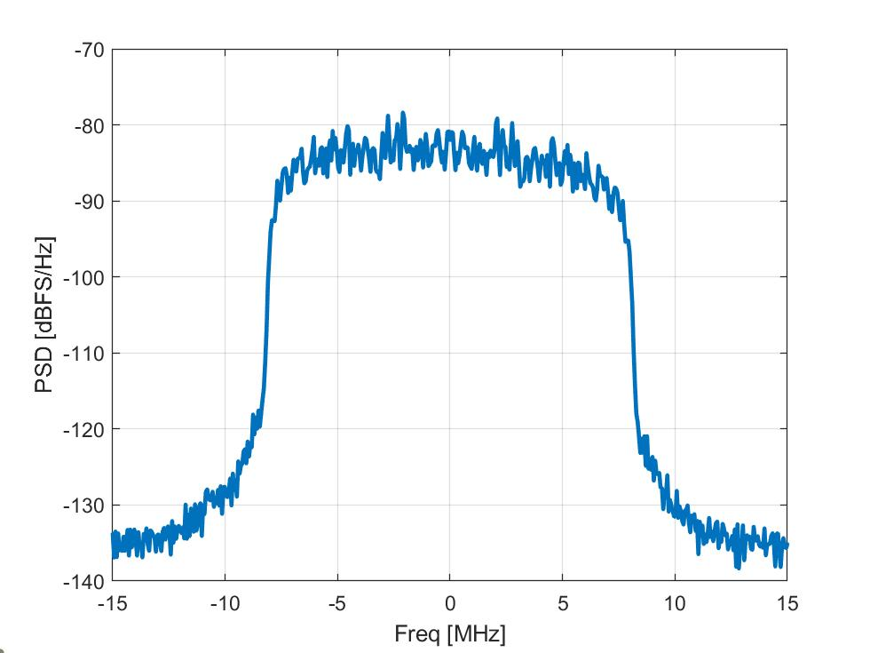

# Lab 3: Symbol Mapping and TX Filtering

In this lab, you will learn to:
 
* Create a sequence of QAM symbols
* Design an FIR interpolation filter
* Upsample and modulate the symbols with the designed filter
* Select the appropriate backoff for the TX
* Measure the TX and RX PSD
* Continuously measure the RX PSD to create a simple spectrum analyzer

## Files:  

The lab is in`labSymMod.mlx`:  [[Matlab]](./labSymMod.mlx) [[PDF]](./labSymMod.pdf).

For the lab, complete the `TODO` sections, run the script, and print to PDF.
Submit the PDF.  Do not submit the source code.
