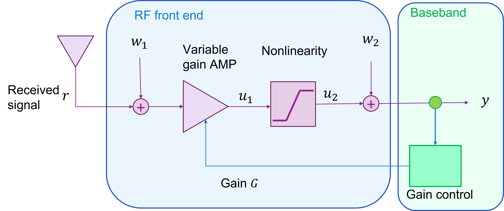
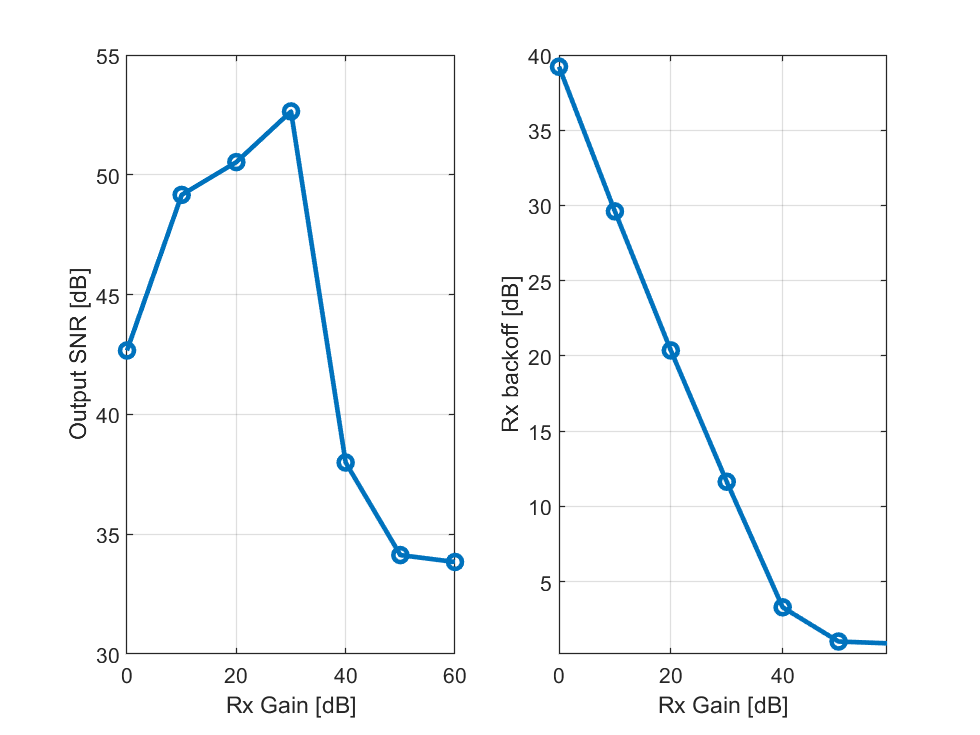

# Lab 5: Gain Control and Building a Simple AGC

Gain control is a fundamental operation in a receiver to adjust signal levels to a correct value.   In this lab, you will learn to:

* Mathematically model a receiver with variable gain and saturation
* Simulate the effect of gain and nonlinearities on the output SNR
* Manually control the gain on the SDR
* Measure the RX backoff of a received signal
* Build a simple AGC to maintain a target RX backoff
* Measure the RX power with gain

## Files:

* The main file is `gainControl.mlx`:  [[Matlab]](./gainControl.mlx) [[PDF]](./gainControl.pdf).
* You will need to copy the completed estChanResp.m file from the previous lab to the current directory.  

For the lab, complete the `TODO` sections in both files, run `chanSounder.mlx`,
and print to PDF.  Submit the PDF.
