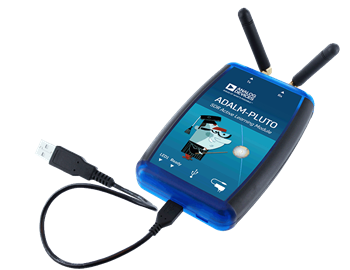

# Software Defined Radio labs

[Sundeep Rangan](https://wireless.engineering.nyu.edu/sundeep-rangan/), Professor, ECE, New York University

This repo contains some simple labs for software defined radios (SDRs).  I am developing these to be used in conjunction
with the undergraduate and graduate digital communications classes at New York University.  The initial labs are based on
the simple, but excellent [ADALM-Pluto boards](https://www.analog.com/en/design-center/evaluation-hardware-and-software/evaluation-boards-kits/adalm-pluto.html)
from Analog Devices. The Pluto devices can be easily run via a well-developed and stable [MATLAB interface](https://www.mathworks.com/help/supportpkg/plutoradio/ug/install-support-package-for-pluto-radio.html).  NYU students enrolled in the class will be able to borrow a Pluto device from the TA.  All NYU students also have free access to MATLAB.

## Overview
All labs require one or two Pluto devices and one or two host computers.  Windows, MAC, or Linux should be fine, but I have only tried Windows so far.
I am hoping to make most labs runs in one of three modes:
* *Loopback* where a single Pluto is connected to a single PC and you TX and RX from the same device.  This is the simplest, but obviously results in uninteresting channels.
* *Two devices, single host* where two Pluto devices are connected to the same host.  One is used for TX and the second for RX.  This allows somewhat more interesting channels, but you can only separate the devices by the length of the cables from the host PC.
* *Two devices, two hosts* where two Pluto devices are connected to two different hosts.  One is used for TX and the second for RX.  This allows the most realistic channels, but you will require two hosts.
NYU students enrolled in the class are provided one Pluto each.  So, the two device experiments require a partner.

In most of the initial labs, the TX will simply repeatedly transmit the identical data in a continuous loop.  The RX will capture samples and the processing will be performed offline. This method provides the full realism of a channel, but is limited to a short burst of communication.

Each lab is provided as a MATLAB Live script.  Students should download the script and fill in the sections labeled `TODO`.  NYU students in the class should fill in the `TODO` sections, print the PDF and submit the PDF.  Labs should be performed with two students.  Submit only one lab per pair.  NYU students will be provided the solutions in class.  If you are instructor and interested in the solutions, please write me.  

The website is still under construction and will evolve over the semester.  

## Feedback

Any feedback is welcome.  If you find errors, have ideas for improvements,
or want to voice any other thoughts, [create an issue](https://help.github.com/articles/creating-an-issue/)
and we will try to get to it.
Even better, fork the repository, make the changes yourself and
[create a pull request](https://help.github.com/articles/about-pull-requests/)
and we will try to merge it in.  See the [excellent instructions](https://github.com/ishjain/learnGithub/blob/master/updateMLrepo.md)
from the former TA Ish Jain.

## Labs

* Lab 1:  Setting up the SDR and capturing and receiving baseband samples
    * [Directory for files](./lab01_intro/)
* Lab 2:  Digital modulation and frequency correction
* Lab 3:  SNR and gain control
